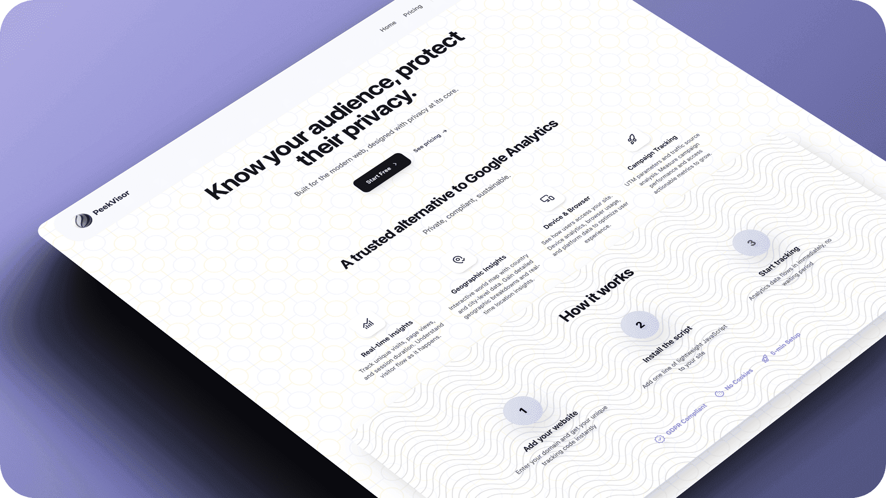

<div align="center">
  <a href="https://peekvisor.com" target="_blank">
    
  </a>

  [](LICENSE)
  [](https://www.linkedin.com/company/peekvisor-analytics)

  [Get Started](https://peekvisor.com) •  [Pricing](https://peekvisor.com/pricing) • [Support](https://peekvisor.com/contact)
</div>

---

## Overview

Peekvisor is the intelligent, privacy-first alternative to Google Analytics. Designed for modern websites and businesses, Peekvisor delivers real-time insights with an AI-guided setup that takes just 5 minutes. No cookies, no complex configurations — just powerful analytics that respect user privacy and comply with GDPR regulations.

Track visitors, campaigns, devices, and geography with unlimited page views across all plans, starting completely free.

<br>

<div align="center">
  
  <a href="https://peekvisor.com" target="_blank">
      
  </a>

</div>

## Why Choose Peekvisor?

In a world of complex analytics tools, Peekvisor stands out by combining powerful features with simplicity and privacy. Unlike traditional platforms that require days of setup and compromise user data, Peekvisor empowers you with:

<div align="center">

| Feature | Description |
|---------|-------------|
| **Real-Time Analytics** | Monitor live visitor behavior, page views, and engagement without limits |
| **Intelligent Campaign Tracking** | Understand UTM parameters and marketing performance effortlessly |
| **Device & Geography Insights** | See exactly where your users are coming from and what devices they use |
| **Privacy by Design** | No cookies, full GDPR compliance, and complete data ownership |
| **AI-Powered Setup** | Smart wizard detects your tech stack and provides tailored installation |

</div>

## Key Features

### Real-Time Visitor Analytics
Get instant insights into your website's performance with unlimited page views. Track unique visitors, session duration, and bounce rates in real-time.

### Advanced Campaign Tracking
Monitor UTM parameters, referral sources, and marketing campaigns. Understand exactly which channels drive traffic and conversions.

### Device & Browser Intelligence
Break down traffic by device type, operating system, and browser. Optimize your site for mobile, desktop, and emerging technologies.

### Geographic Insights
Visualize visitor locations worldwide. Identify regional trends and tailor your content for specific markets.

### Privacy-First Architecture
- GDPR and privacy law compliant
- No third-party cookies or trackers
- Full data ownership and control
- Transparent metrics without hidden processing

### AI-Guided Installation
Our intelligent setup wizard makes implementation effortless:
- Automatically detects your framework (React, Angular, Vue, Next.js, etc.)
- Provides OS-specific commands (macOS, Linux, Windows)
- Recommends optimal script placement
- Generates ready-to-use code snippets


## Subscription Plans

Peekvisor offers flexible, transparent pricing powered by [Lemon Squeezy](https://www.lemonsqueezy.com/) for seamless billing and subscription management. All plans include unlimited page views and real-time analytics.

<table align="center">
  <thead>
    <tr>
      <th align="center">BASIC</th>
      <th align="center">FLEX</th>
      <th align="center">PRO</th>
    </tr>
  </thead>
  <tbody>
    <tr>
      <td align="left">
        ✓ 1 Website<br/>
        ✓ 30 Days Retention<br/>
        ✓ Core Analytics<br/>
        ✓ Real-Time Data<br/>
        ✓ Privacy-First<br/>
        ✓ No Credit Card
      </td>
      <td align="left">
        ✓ 5 Websites<br/>
        ✓ 180 Days Retention<br/>
        ✓ Custom Events<br/>
        ✓ UTM Tracking<br/>
        ✓ Data Export (CSV/PDF)<br/>
        ✓ Email Reports
      </td>
      <td align="left">
        ✓ Unlimited Websites<br/>
        ✓ Unlimited Retention<br/>
        ✓ All Flex Features<br/>
        ✓ CO₂ Footprint Reports<br/>
        ✓ API Access<br/>
        ✓ Public Dashboards
      </td>
    </tr>
    <tr>
      <td colspan="3" align="center">
        <br/>
        <strong>Lemon Squeezy Benefits</strong><br/>
        Instant Setup • Global Payments • Automatic Tax Handling<br/>
        Secure Subscriptions • No Hidden Fees • 24/7 Support
      </td>
    </tr>
  </tbody>
</table>

All subscriptions are managed through Lemon Squeezy, ensuring secure payments, automatic renewals, and hassle-free upgrades. Plans renew monthly with pro-rated changes and easy cancellations.


<div align="center">
  
[**→ Start Your Free Plan**](https://peekvisor.com/pricing)

</div>


## Trust & Security

Your data is our priority. Peekvisor is built with enterprise-grade security:

<table align="center">
  <thead>
    <tr>
      <th align="center">Data Security</th>
      <th align="center">Compliance & Privacy</th>
      <th align="center">Ownership Rights</th>
    </tr>
  </thead>
  <tbody>
    <tr>
      <td align="left">
        • End-to-End Encryption<br/>
        • Secure Webhooks<br/>
        • Lemon Squeezy Payments<br/>
        • SSL/TLS Protection
      </td>
      <td align="left">
        • GDPR Compliant<br/>
        • No Cookies Required<br/>
        • Privacy-First Design<br/>
        • Anonymous Tracking
      </td>
      <td align="left">
        • Full Data Ownership<br/>
        • Export Anytime<br/>
        • No Data Selling<br/>
        • Your Analytics Only
      </td>
    </tr>
  </tbody>
</table>

## Get Started in 5 Minutes

```bash
1. Sign Up Free         → Use Google OAuth for instant access
2. AI Setup Wizard      → Get customized installation for your tech stack
3. Track Instantly      → Add one line of code and see real-time data
4. Analyze & Grow       → Access insights, reports, and optimizations
5. Scale Seamlessly     → Upgrade via Lemon Squeezy as you grow
```

### Quick Installation

```html
<!-- Add this single line to your website -->
<script src="https://script.peekvisor.com/hello.js"></script>
```

The AI wizard will detect if you're using:
- **Frontend Frameworks**: React, Vue, Angular, Svelte
- **Meta-Frameworks**: Next.js, Nuxt, Gatsby, Astro
- **Platforms**: WordPress, Shopify, Webflow
- **Operating Systems**: macOS, Linux, Windows

[**→ Get Started Today**](https://peekvisor.com)

## What Makes Us Different

<div align="center">
  
| Traditional Analytics | Peekvisor |
|----------------------|-----------|
| Complex setup (hours/days) | 5-minute AI-guided setup |
| Cookie-dependent tracking | Cookie-free, privacy-first |
| Limited free tier | Generous free plan forever |
| Confusing interfaces | Clean, intuitive dashboard |
| Data sold to third parties | Your data stays yours |
| Expensive upgrades | Transparent, affordable pricing |

</div>


## Community & Support

Join the Peekvisor community for updates, discussions, and support:


- **Documentation**: Full guides and API references available
- **Changelog**: Stay updated with the latest features and improvements
- **Support**: Reach our team for personalized assistance
- **Issues**: Report bugs and request features
- **Blog**: Analytics insights and privacy best practices

  
## Perfect For

- **Developers** who want quick integration without documentation hell
- **Marketers** who need campaign insights without complexity
- **Privacy-Conscious Businesses** that prioritize user trust
- **Agencies** managing multiple client websites
- **E-commerce** tracking conversions without cookies
- **SaaS Platforms** monitoring user engagement ethically

## Roadmap

- [x] Core Analytics Engine
- [x] AI-Powered Setup Wizard
- [x] Lemon Squeezy Integration
- [x] GDPR Compliance
- [ ] Desktop App (Q1 2025)
- [ ] Advanced Funnel Analytics (Q2 2025)
- [ ] A/B Testing Platform (Q3 2025)
- [ ] Custom Webhooks API (Q4 2025)

---

<div align="center">
  <a href="https://www.lemonsqueezy.com/" target="_blank">
    
  </a>

  
  ##### © 2025 Peekvisor Analytics. All rights reserved.
</div>